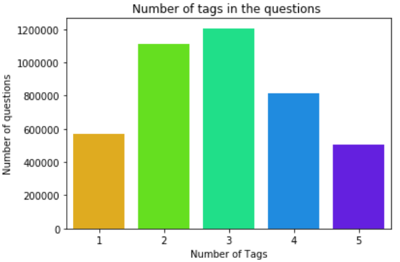

# Tag Prediction 🏷️

`A machine learning model that predicts tags for a given question and body.`

  

**Dataset Link:** https://www.kaggle.com/imoore/60k-stack-overflow-questions-with-quality-rate

## For developers, by developers 👨‍💻

Stack Overflow is an open community for anyone that codes. They help you get answers to your toughest coding questions, share knowledge with your coworkers in private, and find your next dream job.

## Problem Description 

Given a `Title` and the `Body` of a question, we have to predict the relevant tags such that the question gets recommended to the `right domain expert` so that the expert can `answer the question correctly`.

### Business Constraints ✔️

* To predict as many tags as possible with very high `precision` and `recall`.
* `Incorrect tags` could impact the `customer experience` on Stack Overflow.
* No strict latency constraints. The model should be able to generate the relevant tags in a `reasonable` amount of `time`.

The data consists of 4 columns.

1. Id: Represents the ID of the question
2. Title: Represents the title of the question
3. Body: Represents the body of the question where the question is explained properly
4. Tags: The tags relevant for the question asked

### Plots for better understanding 📊

#### Countplot of Tags per question 📈

*`This is the countplot of number of tags per question.`*

  

The key take away from the above plot is that most of the question has `2` or `3` tags in them.

### WordCloud ☁️

*`This is the wordcloud generated from the tags and it's count.`*

  

The more frequent tags appears to be bigger in the wordcloud and vice versa.
